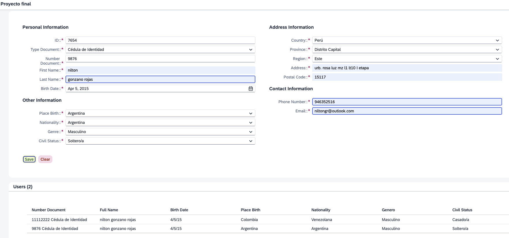

# 📝 Registro de Usuarios con JSONModel en SAPUI5

## 📌 Descripción del ejercicio

Se desarrolló una funcionalidad en SAPUI5 para capturar datos desde un archivo .json y reflejarlos en un select, **sin utilizar base de datos ni servicios OData**. La gestión de registros se realizó a través de un modelo de tipo `JSONModel`.

---

## ✅ ¿Qué se hizo?

### 1. Captura de datos desde el formulario
- Se obtuvieron los valores de los campos `Input`, `Select` y `DatePicker` mediante `byId().getValue()` o `getSelectedItem().getText()`.

### 2. Uso del modelo JSON (`JSONModel`)
- Se creó o reutilizó un `JSONModel` llamado `"users"` para almacenar los datos capturados.
- El modelo se inicializó con una estructura como `{ data: [] }`.

### 3. Actualización de la tabla en tiempo real
- Se enlazó (`data binding`) el modelo a una tabla en la vista XML usando `items="{users>/data}"`.
- Cada nuevo usuario ingresado se insertó en el array del modelo y se reflejó automáticamente en la tabla.

### 4. Campos derivados
- Se construyeron los campos `fullName` y `document` concatenando valores ingresados (por ejemplo, nombre + apellido).

---

## 🛠️ Tecnologías utilizadas

- **SAPUI5 (MVC)**
- `JSONModel` (model)
- JavaScript (controlador)
- XML (vista)

---

## 🎯 Resultado esperado

- Los datos capturados se visualizan automáticamente en la tabla.
- No se requiere base de datos ni backend.
- El manejo de datos es 100% en frontend, usando `JSONModel`.

---

## 📂 Consideraciones adicionales

- Este enfoque es ideal para pruebas, prototipos o ejercicios sin conexión a servicios externos.
- Puede extenderse para agregar funciones como eliminación de registros, descarga en `.json`, o validación de campos.

---
## Screenshot

